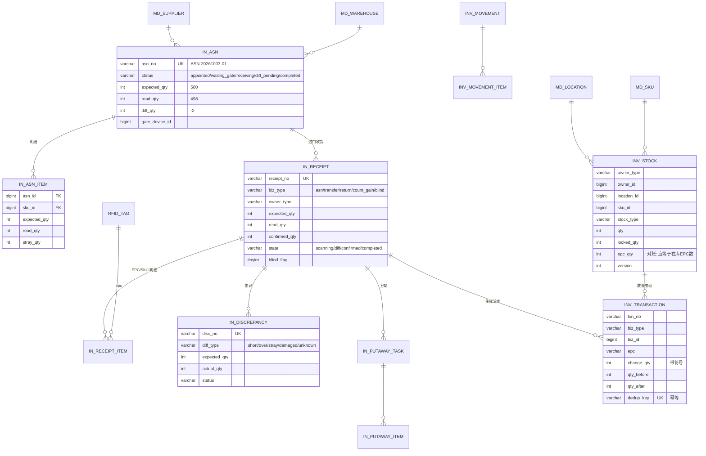
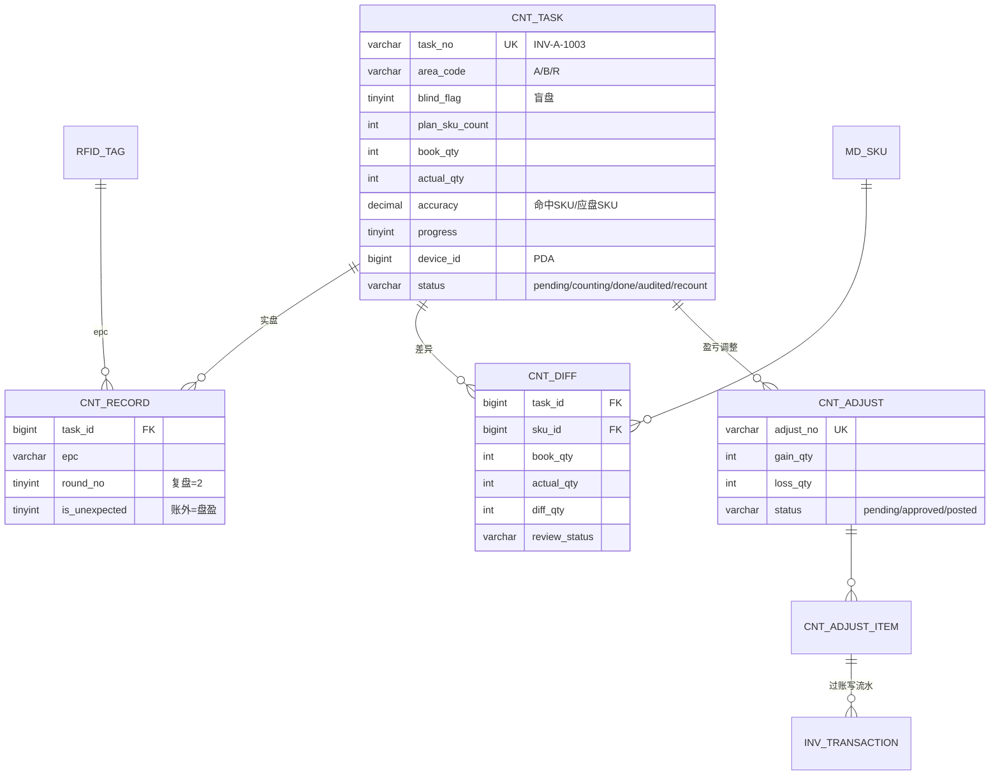
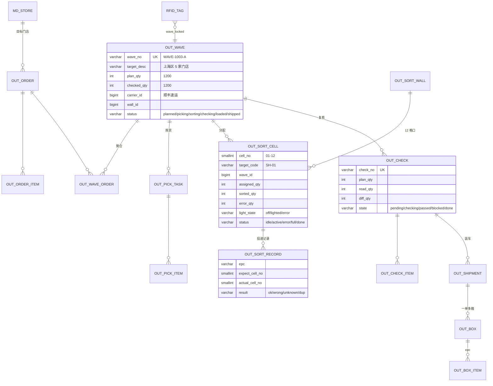
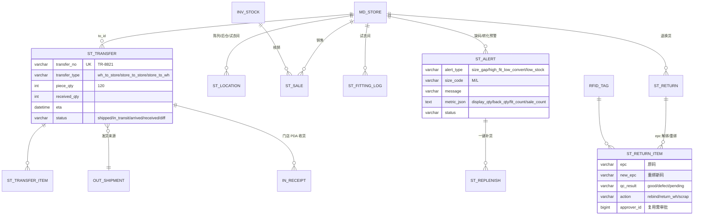

# Apparel WMS · 数据库设计与 ER

> 版本 v1.0 · 2026-10-06 · 对应 DDL：`schema.sql`（MySQL 5.7，共 **54 张表**）
> 需求依据：`项目需求.md` §4–§7、§5 RFID 专项

---

## 1. 建模总纲

### 1.1 三条主线

| 主线 | 表 | 说明 |
|---|---|---|
| **单品主线（EPC）** | `rfid_tag` → `rfid_tag_event` → `rfid_read_log/batch` | 一件衣服从发码到销售/退货的全过程。`rfid_tag` 是**当前状态快照**，`rfid_tag_event` 是**状态变更链**，`rfid_read_log` 是**设备原始证据** |
| **数量主线（SKU）** | `inv_stock` ← → `inv_transaction` | 库存数量台账 + 只增不改的流水。数量以 SKU 维度记账（性能），准确性以 EPC 维度校验（`inv_stock.epc_qty` 应等于该 SKU 在库 EPC 数） |
| **单据主线** | `in_asn/in_receipt` · `cnt_task` · `out_order/out_wave/out_check/out_shipment` · `st_transfer/st_return` | 每个单据驱动一次库存事务，单据状态机在服务层校验 |

**为什么双轨（SKU 数量 + EPC 单品）**：纯 EPC 记账在 1.24M 标签量下无法支撑列表/看板查询；纯 SKU 记账又丢掉了"这一件在哪、有没有被串读、退货是否同一件"的能力。所以：**SKU 记账保证可对账与性能，EPC 档案保证可追溯**，两者用 `inv_stock.epc_qty` 与日汇总做交叉校验。

### 1.2 约定

- 主键 `id bigint unsigned auto_increment`；业务单号另有唯一索引（`uk_*_no`），单号由 `sys_serial_rule/sys_serial_seq` 取号。
- **归属统一**：`owner_type ('warehouse'|'store') + owner_id`，让总仓与门店共用同一套库存/收货/盘点表，避免两套代码。
- 位置统一：`location_id`（仓库库位）与 `st_location`（门店陈列/后仓/试衣间），后者通过 `inv_stock.location_id` 复用同一列（门店库位也建 `md_location` 风格的记录，本项目用 `st_location` + `location_id` 混合时以 `st_location.id` 落入 `location_id`）。
- 状态：单据用 `status`/`state` varchar + 注释枚举；**不使用 MySQL 5.7 不生效的 CHECK**。
- 软删：主数据 `is_deleted`；单据用 `status='cancelled'`。
- 数量 `int`、金额 `decimal(12,2)`、时间 `datetime`（读取时间 `datetime(3)` 带毫秒）。

---

## 2. ER · 主数据与 RFID

```mermaid
erDiagram
  MD_PRODUCT ||--o{ MD_SKU : "款号→色码矩阵"
  MD_COLOR   ||--o{ MD_SKU : "矩阵行"
  MD_SIZE    ||--o{ MD_SKU : "矩阵列"
  MD_CATEGORY ||--o{ MD_PRODUCT : "品类"
  MD_BRAND   ||--o{ MD_PRODUCT : "品牌"
  RFID_EPC_RULE ||--o{ MD_PRODUCT : "默认规则"
  RFID_EPC_RULE ||--o{ RFID_TAG : "按规则发码"
  RFID_TAG_TEMPLATE ||--o{ RFID_PRINT_JOB : "模板"
  MD_SKU ||--o{ RFID_PRINT_JOB : "计划张数"
  RFID_PRINT_JOB ||--o{ RFID_TAG : "绑定产物"
  MD_SKU ||--o{ RFID_TAG : "一品一码"
  RFID_TAG ||--o{ RFID_TAG_EVENT : "生命周期"
  DEV_DEVICE ||--o{ RFID_READ_BATCH : "上报"
  RFID_READ_BATCH ||--{ RFID_READ_LOG : "EPC 明细"
  RFID_READ_LOG }o--|| RFID_TAG : "epc 解析"
  DEV_DEVICE ||--o{ DEV_HEARTBEAT : "心跳"
  DEV_DEVICE ||--o{ DEV_ALARM : "告警"
  DEV_DEVICE ||--o{ DEV_READ_STAT : "日统计"
  DEV_DEVICE ||--o{ DEV_COMMAND : "指令下发"
  MD_WAREHOUSE ||--o{ MD_AREA : "库区"
  MD_AREA ||--o{ MD_LOCATION : "库位"
  MD_WAREHOUSE ||--o{ MD_LOCATION : ""
  MD_STORE }o--|| MD_WAREHOUSE : "归属补货仓"
  MD_SUPPLIER ||--o{ IN_ASN : ""
  MD_CARRIER ||--o{ OUT_SHIPMENT : ""

  MD_PRODUCT {
    bigint id PK
    varchar spu_code UK "款号 AW26-JK-01"
    varchar name
    varchar season "2026秋"
    varchar wave "波1"
    bigint epc_rule_id FK
    decimal tag_price
  }
  MD_SKU {
    bigint id PK
    varchar sku_code UK "AW26-JK-01-BK-L"
    bigint product_id FK
    bigint color_id FK
    bigint size_id FK
    varchar barcode "UPC/EAN-13"
    tinyint is_on_sale
  }
  RFID_TAG {
    varchar epc UK "96bit hex 24位"
    bigint sku_id FK
    varchar status "bound→in_stock→…→sold"
    varchar owner_type "warehouse/store"
    bigint owner_id
    bigint location_id
    varchar stock_type
    bigint wave_id
    int version
  }
  RFID_TAG_EVENT {
    varchar epc FK
    varchar event_type "bind/receive/putaway/ship/sale/unbind"
    varchar from_status
    varchar to_status
    bigint biz_id
    bigint device_id
  }
  RFID_EPC_RULE {
    varchar rule_code UK
    varchar rule_type "upc_sn/ean13_sn/custom_96"
    tinyint epc_length
    varchar header_hex
    bigint serial_current
  }
  RFID_PRINT_JOB {
    varchar job_no UK
    bigint sku_id FK
    int planned_qty
    int printed_qty
    varchar status
  }
  DEV_DEVICE {
    varchar device_code UK "GATE-A01/PDA-05"
    varchar device_type "gate/desktop/printer/pda/sortwall/fitting"
    varchar driver "sim 或厂商编码"
    varchar online_status
    int heartbeat_limit_s
    int dedup_window_s
    smallint rssi_min
  }
  RFID_READ_BATCH {
    varchar batch_no UK "幂等键"
    varchar scene
    varchar biz_type "asn/stocktake/sort/check"
    bigint biz_id
    int raw_count
    int distinct_count
    int stray_count
  }
  RFID_READ_LOG {
    bigint batch_id FK
    varchar epc
    smallint rssi
    tinyint antenna_no
    tinyint is_first "窗口内首次才计件"
    tinyint is_stray
    datetime read_time
  }
```

**设备驱动字段 `dev_device.driver` 是适配层落点**：`sim` 驱动由 `php think rfid:sim` 生成读取批次走完全相同的业务链路，真机到货只换 driver 实现，业务零改动（对应风险 R1）。

---

## 3. ER · 入库与库存



### 收货 → 库存 的数据流（关键实现点）

```
设备上报 POST /device/read {device_code, batch_no, epcs[], rssi[], scene, biz}
  → rfid_read_batch (uk batch_no 幂等；先落库并回 202)
  → Redis Stream → 消费者：
       1) 窗口去重 → rfid_read_log(is_first/is_stray)
       2) epc → rfid_tag 解析 sku_id；无档 → unknown_count
       3) 属于本 ASN？否则 is_stray=1 记异常件
       4) 回写 in_asn_item.read_qty / in_receipt.read_qty / diff_qty
       5) 人工点"确认收货" → 单事务：
            inv_stock  += qty          (uk_stock_dim upsert)
            inv_transaction 插入       (dedup_key 防重复记账)
            rfid_tag.status = in_stock, owner/location 赋值
            rfid_tag_event 插入
            in_receipt.state = confirmed
       6) 差异>0 → in_discrepancy + ASN.status=diff_pending（阻断完成，业务规则1）
```

---

## 4. ER · 盘点



`cnt_record` 上的 **`uk_task_epc_round (task_id, epc, round_no)`** 是"挥扫重复只算一件"的数据库级保证（RF-06 的结果表落点），原始重复仍留在 `rfid_read_log` 供漏读率统计。

---

## 5. ER · 出库、波次与分拣墙



防错规则落点：`out_sort_record.result='wrong'` 当且仅当 `expect_cell_no <> actual_cell_no`；错投**不增加** `cell.sorted_qty`（业务规则4），报警走 `dev_command(light_on/error)`。

---

## 6. ER · 门店协同



在途账：`st_transfer.status='in_transit'` 期间，货记在 `stock_type='transit'`（发货方扣减、收货方未加），门店收货确认后才写门店 `inv_stock`（业务规则10，避免双记）。

---

## 7. 表清单（54 张）

| 域 | 表 | 量级/写入频率 |
|---|---|---|
| 系统 sys (12) | `sys_user` `sys_role` `sys_user_role` `sys_permission` `sys_role_permission` `sys_dict_type` `sys_dict_item` `sys_config` `sys_serial_rule` `sys_serial_seq` `sys_idempotency` `sys_operation_log` `sys_login_log` `sys_import_batch` | 日志高频，其余低 |
| 主数据 md (11) | `md_brand` `md_category` `md_color` `md_size` `md_supplier` `md_carrier` `md_warehouse` `md_store` `md_area` `md_location` `md_product` `md_sku` | 低频读多 |
| RFID (5) | `rfid_epc_rule` `rfid_tag_template` `rfid_print_job` `rfid_tag` `rfid_tag_event` | tag 1.24M，event 高写入 |
| 设备 dev (5) | `dev_device` `dev_heartbeat` `dev_alarm` `dev_read_stat` `dev_command` | 心跳高频（30 天） |
| 入库 in (7) | `in_asn` `in_asn_item` `in_receipt` `in_receipt_item` `in_discrepancy` `in_putaway_task` `in_putaway_item` | 中 |
| 库存 inv (5) | `inv_stock` `inv_transaction` `inv_movement` `inv_movement_item` `inv_safety_stock` | 流水高写入 |
| 盘点 cnt (4) | `cnt_task` `cnt_record` `cnt_diff` `cnt_adjust` `cnt_adjust_item` | 单次盘点万级 |
| 出库 out (12) | `out_order` `out_order_item` `out_wave` `out_wave_order` `out_pick_task` `out_pick_item` `out_sort_wall` `out_sort_cell` `out_sort_record` `out_check` `out_check_item` `out_shipment` `out_box` `out_box_item` | 中 |
| 门店 st (7) | `st_transfer` `st_transfer_item` `st_location` `st_sale` `st_fitting_log` `st_alert` `st_replenish` `st_return` `st_return_item` | 销售/试衣间中 |
| 报表 rpt (3) | `rpt_daily_owner` `rpt_daily_sku` `rpt_epc_stat` | 日批 |
| 原始读取 (1) | `rfid_read_log` | **日增约 500 万** |

---

## 8. 关键查询与索引对照

| 场景 | 查询 | 命中索引 |
|---|---|---|
| EPC 反查单品 | `rfid_tag WHERE epc=?` | `uk_epc` |
| 库区盘点差异定位 | `rfid_tag WHERE owner_type='warehouse' AND owner_id=? AND status='in_stock'` | `idx_owner` |
| 看板"今日入库件数" | `rpt_daily_owner WHERE stat_date=CURDATE() AND owner_type='warehouse'` | `uk_date_owner` |
| 通道门实时计数 | `in_receipt.read_qty`（消费者增量更新，不聚合日志） | `uk_receipt_no` |
| SKU 库存矩阵 | `inv_stock WHERE owner_*=? AND sku_id IN (SELECT id FROM md_sku WHERE product_id=?)` | `uk_stock_dim` + `idx_product` |
| 雷达找货 | `rfid_read_log WHERE epc=? ORDER BY read_time DESC LIMIT 5` | `idx_epc_time` |
| 漏读率统计 | `dev_read_stat` 日汇总 + `in_asn_item.expected_qty - read_qty` | `uk_dev_date_scene` |
| 对账（P0 验收 8/9） | `SUM(inv_transaction.change_qty)` vs `inv_stock.qty`、`inv_stock.epc_qty` vs `COUNT(rfid_tag in_stock)` | `idx_sku_time` / `idx_stock_dim` |

---

## 9. 容量与运维

| 表 | 3 年估算 | 策略 |
|---|---|---|
| `rfid_tag` | 1.24M × 年增 500 万 ≈ 1600 万 | 单表可撑；`sold/scrapped/unbound` 满 12 个月后迁到同结构冷表 `rfid_tag_arch`（**schema v1 未建**，作为 P1 迁移脚本 `rfid_tag_arch` 交付）后 DELETE |
| `rfid_read_log` | 日 500 万，90 天 ≈ 4.5 亿 | **必须** 月表 `rfid_read_log_YYYYMM` 或 RANGE 分区 + 归档；统计走 `dev_read_stat` |
| `rfid_tag_event` | 与 tag 同量级 × 事件数 | 保留 1 年，按月归档 |
| `inv_transaction` | 日 10 万，年 4000 万 | 只增；索引控制在 4 个；冷数据按年拆表 |
| `sys_operation_log` | 日 2 万 | 60 天后归档 |

- 备份：`xtrabackup` 每日全量 + binlog；恢复演练每月一次。
- 慢查询阈值 1s，每周复盘 Top10。
- 迁移：`think-migration` 版本化，禁止手工 ALTER 生产。

---

## 10. 与需求条目的一致性检查

| 需求 | 表/字段落点 |
|---|---|
| FR-MD-02 色码矩阵 | `md_sku(product_id,color_id,size_id)` 透视 + `inv_stock` 聚合 |
| FR-MD-04 EPC 规则 | `rfid_epc_rule`（header/tmf/company/serial/mask） |
| FR-MD-05 发码打印 | `rfid_print_job` → `rfid_tag.print_job_id/batch_no` |
| FR-IN-02/03 过门与差异 | `in_receipt.read_qty/expected_qty/diff_qty` + `in_discrepancy` |
| FR-IV-01 台账五口径 | `inv_stock.qty / locked_qty / stock_type(transit,frozen,defect)` |
| FR-IV-04 盲盘 | `cnt_task.blind_flag` |
| FR-IV-06 雷达找货 | `rfid_read_log.rssi + antenna_no` |
| FR-OB-03 分拣墙防错 | `out_sort_cell` + `out_sort_record.result` |
| FR-OB-05 复核拦截 | `out_check.state='blocked'` |
| FR-ST-04 缺码预警 | `st_alert(alert_type='size_gap', size_code)` + `inv_safety_stock` |
| FR-ST-05 试穿转化 | `st_fitting_log` + `st_sale` → `st_alert.metric_json` |
| FR-ST-07 退换货重绑 | `st_return_item.epc/new_epc/approver_id` + `rfid_tag_event(unbind/rebind)` |
| FR-DV-02 心跳判离线 | `dev_device.heartbeat_limit_s/last_heartbeat_at/online_status` |
| RF-06 去重窗口 | `dev_device.dedup_window_s` + `rfid_read_log.is_first` + `cnt_record.uk_task_epc_round` |
| 业务规则10 在途 | `inv_stock.stock_type='transit'` |
